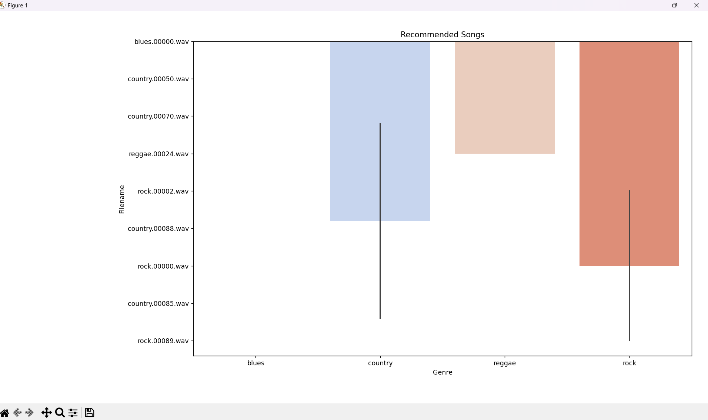

# Music Recommendation System

A KNN-based content recommendation engine that suggests similar songs based on audio features extracted from `.wav` files. This system analyzes the raw audio to identify sonic similarity and recommends tracks accordingly.

---

##  Features

- Extracts 27+ audio features using `librosa` (chroma, MFCCs, tempo, etc.)
- Uses a trained K-Nearest Neighbors (KNN) model to find similar tracks
- Scales input features using `StandardScaler`
- Visualizes top-N recommendations by genre
- Works on raw audio files without needing metadata or user preferences

---

##  Tech Stack

- Python 3.x
- `librosa` – Audio processing
- `scikit-learn` – Model training and scaling
- `joblib` – Model serialization
- `pandas`, `NumPy` – Data handling
- `matplotlib`, `seaborn` – Visualization

---

## Project Structure

```
music-recommender/
├── music_recommender.py           # Main script
├── features.csv                   # Dataset with features and metadata
├── knn_model.joblib               # Trained KNN model
├── scaler.joblib                  # Fitted StandardScaler
├── feature_cols.pkl               # List of selected feature columns
├── output_recommendation.png      # Sample visualization
├── requirements.txt               # Python dependencies
└── README.md                      # Project documentation
```

---

##  Features Extracted

- **Chroma STFT**
- **RMS Energy**
- **Spectral Centroid, Bandwidth, Rolloff**
- **Zero Crossing Rate**
- **Tempo (BPM)**
- **MFCCs 1–20**

---

##  How It Works

1. Load your trained model (`knn_model.joblib`) and feature column list
2. Upload a song file (.wav)
3. Extract features using `librosa`
4. Scale the extracted features
5. Use KNN to find and recommend similar songs from the dataset
6. Display results in a genre-wise bar plot

---

##  How to Run

1. **Clone the repository**

```bash
git clone https://github.com/yourusername/music-recommender.git
cd music-recommender
```

2. **Install dependencies**

```bash
pip install -r requirements.txt
```

3. **Run the script**

```bash
python music_recommender.py
```

4. **Enter path to your `.wav` file** and receive top recommendations.

---

##  Sample Output



*Above: Visualization of recommended songs categorized by genre based on audio similarity.*

---

##  Future Improvements

- Add real-time audio support (microphone input)
- Switch to cosine similarity or deep learning models
- Build a Streamlit or Gradio-based web app
- Integrate Spotify API for live song queries

---

##  Contact

For queries, feedback, or collaboration, reach out at:  
📧 **bhavye.23fe10cds00128@muj.manipal.edu**

---

##  License

This project is open-sourced under the [MIT License](LICENSE).

---

⭐️ If you find this useful, consider giving the repo a star!
